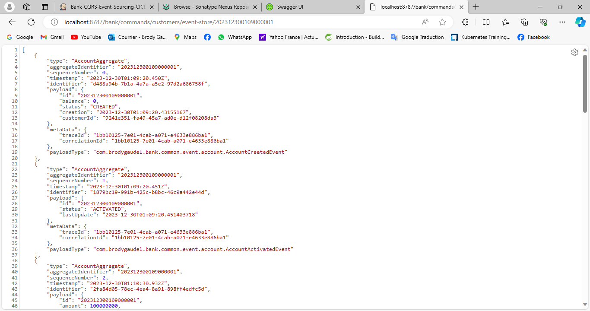

# Banking and Operations Management Application

## Overview

Welcome to the Banking and Operations Management Application, a comprehensive solution for handling customer management and bank account operations such as credit, debit, and transfers. This application is developed using the CQRS (Command Query Responsibility Segregation) and Event Sourcing architecture to ensure a robust and scalable system.

## Features

### Customer Management Module

- **Create Customer:**
    - Allows the creation of new customer profiles with essential information.

- **View Customer Details:**
    - Provides the ability to retrieve and view customer details.

- **Update Customer Information:**
    - Allows updating customer information such as name, contact details, etc.

- **Delete Customer:**
    - Enables the removal of customer profiles when necessary.

### Bank Account and Operations Management Module

- **Create Bank Account:**
    - Facilitates the creation of new bank accounts for customers.

- **Credit:**
    - Allows the addition of funds to a bank account.

- **Debit:**
    - Enables the withdrawal of funds from a bank account.

- **Transfer:**
    - Allows transferring funds between different bank accounts.

- **View Account Balance:**
    - Provides the ability to check the balance of a bank account.

## Technology Stack

- **Java 17:**
    - The core programming language used for the application.

- **Spring Boot 3.2.1:**
    - Provides a robust and convention-over-configuration framework for building Java-based enterprise applications.

- **Axon Framework 4.9.1:**
    - Utilized for implementing the CQRS and Event Sourcing architecture, ensuring separation of concerns and scalability.

- **Axon Server:**
    - Serves as the communication and coordination hub for the Axon Framework, ensuring reliable event processing.

- **MySQL:**
    - The chosen relational database for storing customer and bank account information.
- **CICD:**
    - Jenkins
    - Maven
    - SonarQube
    - Nexus
    - Docker
    - Kubernetes
  

## Getting Started

1. **Clone the Repository:**
   ```bash
   git clone https://github.com/BrodyGaudel/bank-cqrs-event-sourcing.git
   cd bank-cqrs-event-sourcing
   ```

2. **Build, Test and Run:**
   ```bash
   mvn clean install
   mvn test
   mvn spring-boot:run
   ```

3. **Access the Application:**
    - The application will be accessible at `http://localhost:8787/bank/swagger-ui.html`.

## Configuration

- **Database Configuration:**
    - Configure your MySQL database connection details in `application.properties`.

- **Axon Server Configuration:**
    - Ensure that Axon Server is running and configure the connection details in `application.properties`.
    - You can download Axon Server here: `https://developer.axoniq.io/download`.
    - You will find documentation on Axon Framework and Axon Server here: `https://docs.axoniq.io/reference-guide/axon-framework/introduction`.

## Illustration

- **Jenkins:**
    - 
    - 
  
- **Nexus Repository:**
    - 
    - 

- **Docker**
    - 
    - 

- **Axon Server**
  - 
  - 

- **Swagger UI:**
  - 
  - 
  

## Documentation

For detailed information on API endpoints and usage, refer to the [API Documentation](docs/API_DOCUMENTATION.md).

## Contributing

Contributions are welcome! Feel free to open issues or pull requests for any improvements or new features.

## License

This project is licensed under the [MIT License](LICENSE).

## Author

Brody Gaudel MOUNANGA BOUKA